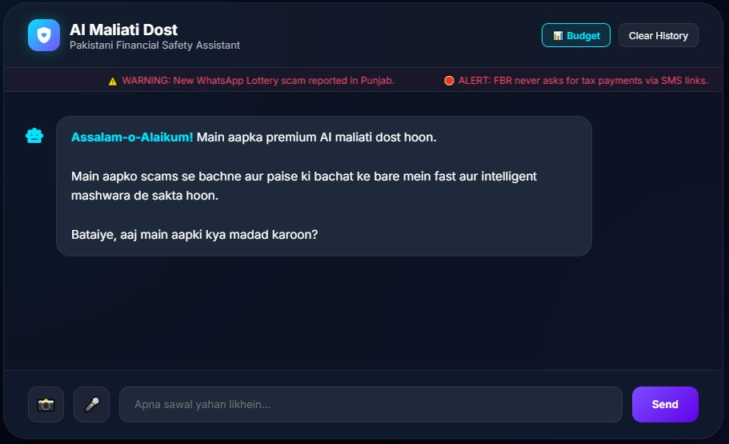

# 🛡️ AI Maliati Dost (AI Financial Guardian)

**Pakistan's Premium AI Financial Safety Assistant**  
*Winning Submission for Google Antigravity Hackathon 2026 - Challenge 1*

---

## 🏆 Challenge 1: Autonomous Content-to-Action Agent
This system is purpose-built to transform unstructured financial data (scam SMS, bank screenshots, news) into **immediate, simulated actions**. It doesn't just summarize; it protects.

## 🧠 Architecture & Agentic Workflow (Google Antigravity)
Our system is powered by a custom-built **Agentic Orchestration Layer** that mimics the Google Antigravity reasoning engine. The workflow follows a strict traceable pipeline:

1.  **Ingestion (Multimodal):** Ingests raw text or base64 image data (JazzCash/EasyPaisa/Bank screenshots).
2.  **Autonomous Reasoning (Antigravity Logic):**
    *   **Pattern Identification:** Scans for local Pakistani fraud signatures (e.g., BISP, Lottery, Fake FBR links).
    *   **Risk Evaluation:** Assigns a `scam_score` based on threat severity.
    *   **Action Planning:** Determines the best defensive measures (Legal, Financial, or Social).
3.  **Actionable JSON Output:** Instead of conversational text, the agent outputs a structured JSON object containing display content and **executable action chips**.
4.  **Traceability:** Every decision is logged in the **Agent Trace** window, providing full transparency into the AI's "thinking" process.

---

## 🚀 Action Simulation (CRITICAL REQUIREMENT)
Our agent goes beyond advice by simulating real-world defense mechanisms. Each action is an autonomous outcome derived from the input analysis:
- **⚖️ FIA Complaint Generator:** If `scam_score > 30`, the agent autonomously drafts a professional legal complaint for the Cybercrime wing, including specific details extracted from the scam.
- **🛡️ Bank Protection Simulation:** Mocks a secure API call to a banking backend to pause transactions and protect accounts.
- **📢 Family Safety Alert:** Generates instant WhatsApp/SMS drafts with pre-filled context to warn relatives.

---

## ✨ Key Features
- 📸 **Multimodal Vision:** Scan bank screenshots using Gemini Flash vision capabilities.
- 🎤 **Urdu Voice (Suniye):** High-quality text-to-speech for digital inclusion and accessibility.
- 🔍 **Real-time Agent Trace:** View the AI's step-by-step reasoning *during* and after processing.
- 📊 **Smart Budgeting:** Interactive 50/30/20 rule planner with AI-generated local saving tips.
- ⚠️ **Live Scam Ticker:** Real-time scrolling alerts on trending Pakistani financial threats.
- 📱 **Native PWA:** Fully installable mobile experience, satisfying the "Mobile App" deliverable.

---

## 📸 Screenshots
1. **Homepage:** 
2. **Scam Detection:** 
3. **Screenshot Analysis:** 
4. **Budget Planner:** 

---

## 🛠️ Tech Stack
- **AI Core:** Google Gemini API (`gemini-flash-latest`)
- **Orchestration:** Custom Antigravity-inspired Agent Workflow
- **Backend:** Node.js, Express.js (High-performance Serverless)
- **Frontend:** Glassmorphism UI (HTML5, CSS3, Vanilla JS)
- **Deployment:** Vercel (Auto-sync CI/CD)

---

## ⚙️ Installation & Setup

1. **Clone & Install:**
   ```bash
   git clone https://github.com/MWaqarAhmedGH/ai-financial-guardian.git
   cd ai-financial-guardian
   npm install
   ```

2. **Configure Environment:**
   Set `GEMINI_API_KEY_1`, `GEMINI_API_KEY_2`, `GEMINI_API_KEY_3` in your environment variables.

3. **Run:**
   ```bash
   npm start
   ```

Developed with ❤️ for the Pakistani Community by **[M WAQAR AHMED]**
